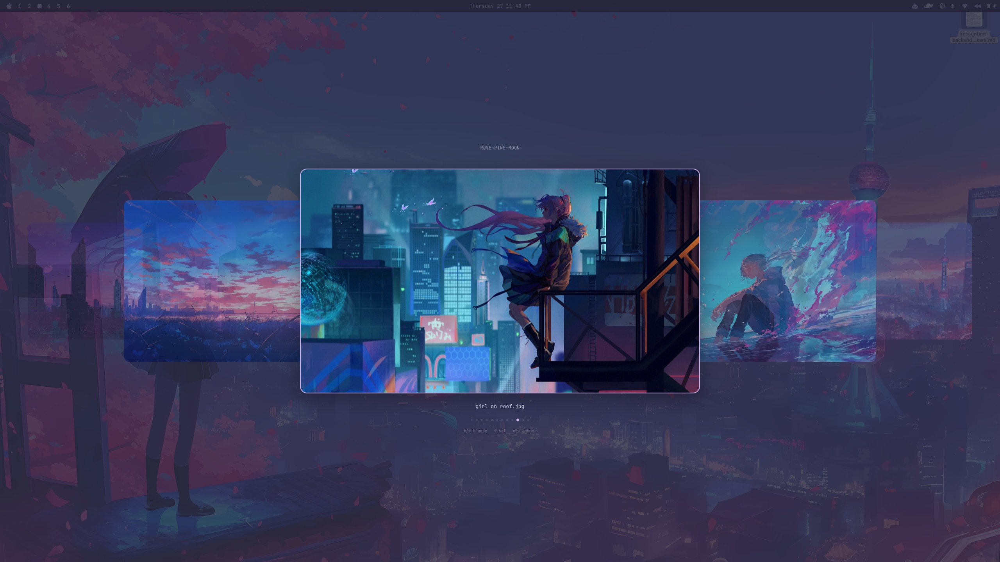

# wallpaper-overlay

[](https://github.com/mayaanhafeez/wallpaper-overlay/actions/workflows/ci.yml)
[](https://www.apple.com/macos/)
[](https://www.swift.org/)
[](LICENSE)

A fast, full-screen coverflow wallpaper picker for macOS. Browse real previews,
select without leaving the keyboard, and match the overlay to your active
SketchyBar theme.

Built as a small native AppKit program with no runtime dependencies. It stays
focused on choosing a file and delegates the actual wallpaper change to your
existing `set-wallpaper` command.



## Highlights

- Native full-screen AppKit overlay with smooth coverflow navigation
- Keyboard and mouse controls, including Vim-style `h` and `l`
- Multi-display dimming with the picker shown on the display under the pointer
- Concurrent thumbnail generation with an on-disk cache for fast repeat launches
- Automatic selection of the current desktop wallpaper
- Optional colors sourced from the active SketchyBar theme
- Broad image support: JPEG, PNG, HEIC, TIFF, GIF, BMP, and WebP

## Requirements

- macOS
- Xcode Command Line Tools (`xcode-select --install`)
- Bash
- A `set-wallpaper` command in `PATH` or at `~/.local/bin/set-wallpaper`

The optional theme integration is designed for my custom
[`set-theme`](https://github.com/mayaanhafeez/set-theme) workflow and expects:

- An active theme name written by `set-theme` to `~/set-theme/current_theme`
- SketchyBar palettes under `~/.config/sketchybar/themes/`

You do not need `set-theme` when passing a wallpaper directory explicitly. The
overlay has built-in fallback colors.

## Install

```sh
git clone https://github.com/mayaanhafeez/wallpaper-overlay.git
cd wallpaper-overlay
make
```

The `wallpaper-pick` wrapper also builds the native binary automatically on its
first run.

## Usage

With [`set-theme`](https://github.com/mayaanhafeez/set-theme) configured, open
the wallpaper directory for your active theme:

```sh
./wallpaper-pick
```

Or browse a specific directory:

```sh
./wallpaper-pick ~/Pictures/wallpapers/favorites
```

When no directory is supplied, the wrapper reads the current theme and looks in
`~/Pictures/wallpapers/<theme>`. If that folder has no supported images, it falls
back to `~/Pictures/wallpapers`.

## Controls

| Action | Keyboard or mouse |
| --- | --- |
| Previous wallpaper | `Left Arrow` or `h` |
| Next wallpaper | `Right Arrow` or `l` |
| First wallpaper | `Home` |
| Last wallpaper | `End` |
| Apply selection | `Return`, keypad `Enter`, or click the selected card |
| Select a card | Click it |
| Cancel | `Escape` or click outside the picker |

## Integrate

Point a hotkey, SketchyBar item, or launcher at the absolute path to
`wallpaper-pick`. After selection, the wrapper calls:

```sh
set-wallpaper "/absolute/path/to/wallpaper"
```

The picker executable can also be used independently. It prints exactly one
absolute image path to standard output on selection and exits without output on
cancel:

```sh
bin/wallpaper_overlay --dir ~/Pictures/wallpapers --title "Wallpapers"
```

Color flags accept `#rrggbb`, `rrggbb`, or SketchyBar-style `0xaarrggbb` values:

```sh
bin/wallpaper_overlay \
  --dir ~/Pictures/wallpapers \
  --accent '#c4a7e7' \
  --value '#e0def4' \
  --muted '0x99e0def4' \
  --title-color '#908caa' \
  --dim '0xd1191724'
```

## Development

```sh
make check  # Type-check Swift and validate shell syntax
make        # Build the optimized native binary
make clean  # Remove build output
```

CI runs the same checks and ShellCheck on every pull request and push to `main`.

## License

[MIT](LICENSE)
